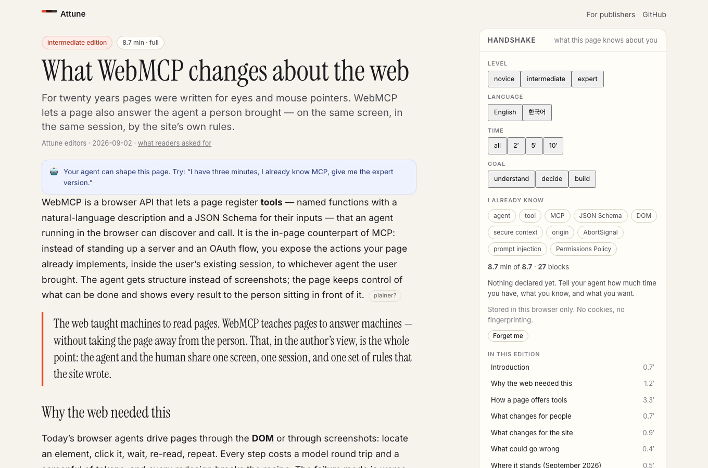
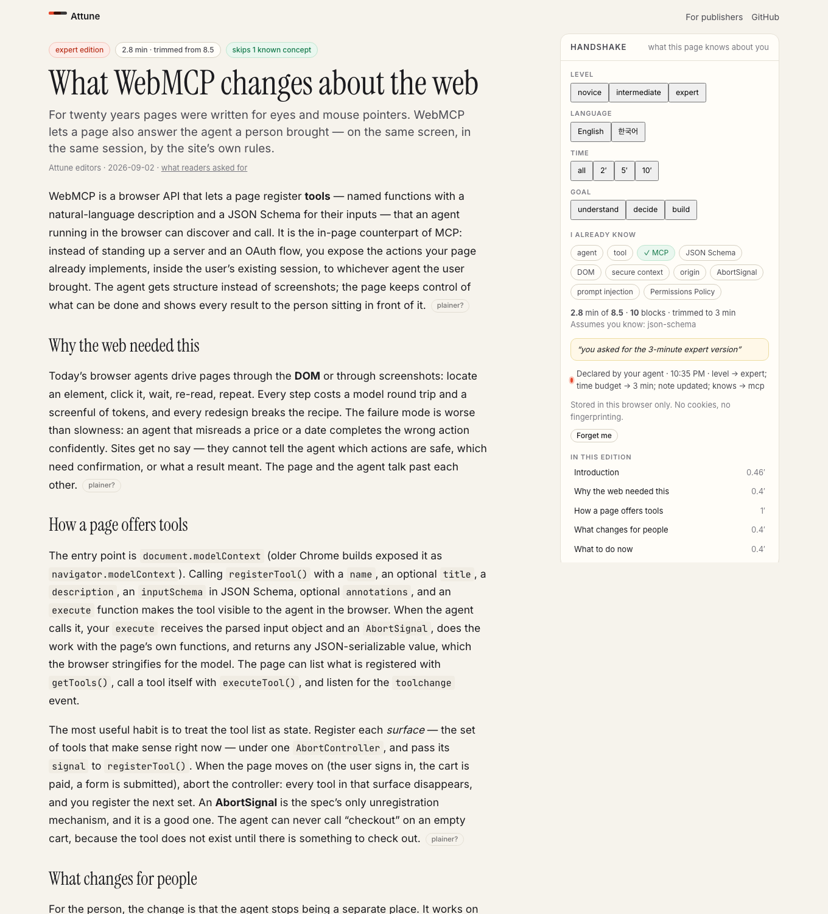
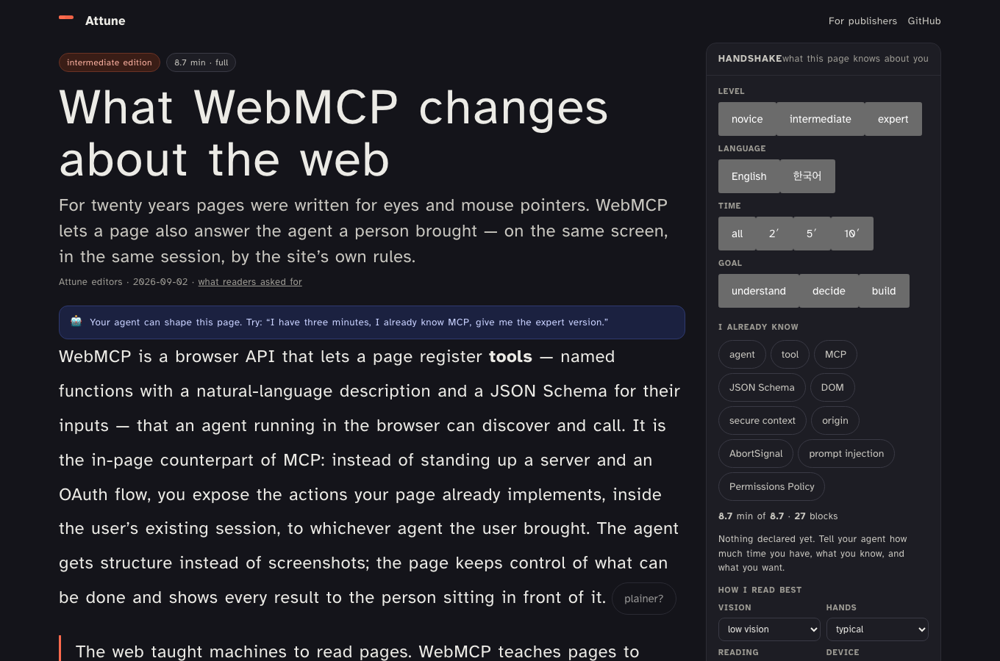

# Attune — pages that negotiate with your agent, not track you

**Live:** https://attune.znehraks.workers.dev · **Repo:** https://github.com/znehraks/attune · **License:** MIT · Built for the [OpenAI WebMCP Challenge](https://webmcp.devpost.com/) (Aug 25 – Sep 3, 2026)

Tell your agent how much time you have, what you already know, and what you're trying to do. Each page on Attune composes an **edition** for you — from the author's own blocks, never generated — and shows you exactly what it was told. No cookies, no profile, no tracking. Interactives your agent can operate. A page that notices where you got stuck and swaps in the author's plainer version, right there.

It is a small publication (three articles, three levels, two languages) and, more importantly, a **pattern for the open web**: the visitor's agent declares what it already knows about the person through WebMCP — how much time they have, what they know, and **how they read best** (vision, hands, attention, device, lighting); the page answers with a tailored edition built from author-approved blocks **and a screen designed for that person** (type size, contrast, font, spacing, layout, target size, motion, one section at a time); the human sees the whole handshake and can change or erase it.

**In one tool call:** the compound-interest article goes from 8.2 minutes / 28 blocks to **2.9 minutes / 12 blocks** for an expert who already knows compounding — and in a second call, from a light serif page to **dark, extra-large, hyperlegible type with big controls** for a low-vision reader in a dark room. Every left-out block and every design choice carries a visible reason.

| Default page | Expert, 3 minutes, knows the basics | Low vision, dark room |
|---|---|---|
|  |  |  |

**No agent at hand?** Press **▶ Watch a 60-second demo** on the home page, or open any article with `?judge=1` (e.g. `/a/compound-interest?judge=1`): a scripted demo calls the very same registered tools, with captions, so you see the negotiation without a WebMCP browser.

Tests: 16 unit (edition composer, needs → design) · 5 Playwright e2e that drive every tool through a `document.modelContext` stand-in, on desktop and on a 390-px phone, against both local and production.

---

## Try it in 60 seconds

### With ChatGPT (the intended experience)
1. Open **https://attune.znehraks.workers.dev** in the built-in browser of the **ChatGPT desktop app** (model **Sol** or **Terra**).
2. Say: *"I have three minutes, I'm a web developer who already knows MCP, and I read Korean. Open the WebMCP article."* — ChatGPT calls `declare_reader_context` and `open_article`; the page composes a three-minute expert edition in Korean that skips what you know, and the Handshake panel shows what was declared.
3. Say *"I have low vision and I'm reading in a dark room"* — the page turns dark with extra-large hyperlegible type, roomy spacing and big controls, and explains each choice in the Handshake panel. (Your agent will do this on arrival, unprompted, if it already knows this about you: the tool description asks it to.)
4. Read for a moment, re-read one paragraph, then ask *"where did I get stuck?"* — `get_reading_friction` names the block; *"make it simpler"* — `simplify_block` swaps in the author's plainer version with a highlight.
5. On the compound-interest article: *"what if I put in 500 a month for 40 years with a 1% fee?"* — `set_interactive` drives the calculator on the page and returns the numbers.
6. *"Did the author say anything about iframes?"* — `ask_author` returns the author's own answer, or says it wasn't covered. *"Forget me"* — `forget_me` erases everything.

### With Chrome 149+
Enable `chrome://flags/#enable-webmcp-testing`, install the [Model Context Tool Inspector](https://chromewebstore.google.com/detail/webmcp-model-context-tool/gbpdfapgefenggkahomfgkhfehlcenpd), open the site and call the tools yourself.

### With no agent
Press **▶ Watch a 60-second demo** on the home page (or add `?judge=1` to any article URL). The **Handshake** panel on every page does the same thing by hand (level, language, time, goal, known concepts, how you read best, display), the **Agent console** lists the live tools, shows every call — the agent's and yours — and lets you run any tool with its parameter schema, and every dense paragraph has a *plainer?* button with an *original* undo.

> **For judges:** no login, no credentials. Everything a tool can do is visible on the page as it happens. The three articles were written for this challenge (WebMCP, compound interest, GPS), each at three levels in English and Korean, with an interactive component your agent can drive.

---

## The idea

Personalization on the web today means **surveillance**: trackers infer who you are from behaviour and sell that inference. Reading with an AI today means **summarization**: the agent scrapes the page and rewrites it — losing the figures and interactives, sometimes inventing details, and cutting the author out of the loop.

Attune tries a third way, which only became possible with WebMCP:

- **The reader's agent declares, on purpose, a handful of coarse facets** — level, language, time budget, goal, concepts already known, and how the person reads best (vision, hands, attention, device, lighting) — taken from what the agent already knows. Nothing else is shared. Everything declared is shown on the page, editable and erasable.
- **The page designs the screen; the agent does not touch CSS.** From declared needs the page picks among layouts, themes and type scales its designers prepared — dark for a dark room, extra-large hyperlegible type and big targets for low vision, a sepia readable-font edition for dyslexia, a focus layout with one section lit at a time for readers who are easily distracted, color-safe encoding for color blindness, a linear layout for screen readers. Every choice carries a reason. Explicit preferences ("darker", "bigger") override the inference.
- **The page composes, deterministically, from author-written blocks.** Filter by level, pull in prerequisites the reader lacks, skip what they know, trim lower-priority blocks to the time budget, drop empty sections. Every block gets a reason. No model rewrites a word.
- **The page stays a page.** Figures stay figures, calculators recalculate with the parameters your agent sets, and the author's "plainer version" of a hard paragraph is one tool call away — at the spot where the page noticed you re-reading.
- **Adoption is a content model, not a platform.** An existing article becomes Attune-ready by splitting it into blocks and adding facets (`levels`, `priority`, `teaches`, `requires`, `goals`, `simplerOf`) — `src/client/content/AUTHORING.md` is the whole guide, `scripts/validate-article.mjs` checks the result, and `src/shared/content.ts` is a dependency-free composer any site can copy. The tool surface is a dozen small, read-mostly tools any page can register.
- **The author learns, anonymously.** The only thing the server stores is a count of which edition shapes were requested — see *"what readers asked for"* under any article. No identifiers, ever.

## Why WebMCP fits (the four submission questions)

1. **Fit.** The reader's context lives in their agent, not in a cookie. WebMCP lets that agent hand a page precisely the context the page needs, in the page's own vocabulary, with the human watching — a negotiation, not a leak. A header can say `Accept-Language: ko`; only a tool call can say "three minutes, knows MCP, wants to build something".
2. **Better than the UI alone.** The Handshake panel exists for people without agents, but nobody wants to click through five facets on every article. The agent already knows them. And the two-way loop — the page reports reading friction, the agent asks the reader and swaps in a plainer block — has no equivalent in a static UI.
3. **Newly possible.** Content that adapts *without* tracking *and* without hallucination: the page owns the variants, the agent owns the context, the human owns the decision. Interactives become tools an agent can operate mid-conversation. Publishers get demand signals without surveillance.
4. **Implementation.** Tool surfaces follow the page: the home surface (`list_articles`, `declare_reader_context`, `open_article`, `get_reader_context`, `forget_me`) and the article surface (22 tools) are swapped with `AbortSignal`s; the article surface name encodes the edition (`article:webmcp:expert:ko`) so re-registrations are precise. Reads are `readOnlyHint`; nothing on this site returns untrusted third-party content. Schemas are loose (enums, ints), validation is strict in code with self-correcting errors, and every mutating result carries a `next_step`.

## Tool surface

| Where | Tools |
|---|---|
| Home | `list_articles` · `declare_reader_context` · `declare_reader_needs` · `set_display` · `get_display` · `open_article` · `get_reader_context` · `forget_me` |
| Article | `get_edition` · `declare_reader_context` · `declare_reader_needs` · `set_display` · `get_display` · `focus_section` · `read_section` · `read_block` · `get_reading_friction` · `simplify_block` · `expand_section` · `ask_author` · `get_glossary` · `mark_known` · `set_interactive` · `get_interactive` · `save_place` · `resume_place` · `list_articles` · `open_article` · `get_reader_context` · `forget_me` |

Design notes that matter for agents:

- `declare_reader_needs` is written to be called **on arrival, before the person asks**, from the agent's own memory (vision, motor, reading, device, lighting). The page maps needs to a design with reasons (`src/shared/needs.ts`); `set_display` records explicit preferences that win over the inference; `focus_section` lights one section and dims the rest.
- Tool hygiene: descriptions under 500 characters (the Chrome security guide's recommendation), `read_section` returns a map (block ids + first sentences) and `read_block` the full text, so a typical result stays small; overlapping tools state their roles.
- `get_edition` is the one-call briefing: level, language, minutes vs. full minutes, outline with section ids and minutes, which blocks were left out and why, concept gaps, available interactives, current reading friction, and a `next_step`.
- `read_section` returns the exact text the human sees, with block ids — cheaper and more faithful than a screenshot, and the basis for explaining anything.
- `declare_reader_context` merges; `knows`/`unknown` are unioned; the result includes the recomposed outline so the agent can tell the reader what changed.
- `simplify_block` never invents: it returns the author's plainer block, or the concept definitions so the agent can explain in its own words and say so.
- `ask_author` answers only from the author's written FAQ and says when something wasn't covered.
- `set_interactive` validates and clamps every parameter against the article's schema and returns the computed result, so the agent can quote the numbers the reader is looking at.
- Every declaration is logged on the page ("Declared by your agent · 10:27 PM · level → expert; time budget → 3 min"), and `forget_me` erases context, friction and saved places.

## The content model

```ts
{ id: 'surfaces', kind: 'para', levels: ['intermediate', 'expert'], priority: 2,
  teaches: ['abort-signal'], requires: ['tool'], goals: ['build'], section: 'how',
  text: { en: '…', ko: '…' } }
```

- **levels** — which editions include the block; the same idea is written as different blocks for different readers.
- **priority** 1–5 — what survives a two-minute budget.
- **teaches / requires** — concept ids; the composer skips what the reader knows and pulls in what they lack (even from another level).
- **goals** — `understand` / `decide` / `build` nudge priorities.
- **simplerOf** — the author's plainer rewrite, used by `simplify_block` and the *plainer?* button.
- Markdown-lite text in English and Korean; inline SVG figures; interactives with a declared parameter schema.

`src/shared/content.ts` holds the model and the composer (`composeEdition`, `simplerVersion`, `deeperBlocks`, `findFaq`, `outline`, `validateArticle`); `src/client/content/*.ts` are the articles; `scripts/validate-article.mjs` checks an article and prints edition sizes for every level/language/time budget. See `src/client/content/AUTHORING.md`.

## Architecture

```
Browser (React 19 + TypeScript, Vite)
  src/shared/content.ts        content model + deterministic edition composer (also unit-tested)
  src/client/lib/tools.ts      tool surfaces (home / article) — descriptions, schemas, executors
  src/client/lib/webmcp.ts     ToolRegistry: registerTool + AbortSignal surfaces, in-page mirror, call log
  src/client/lib/context.ts    the handshake store (localStorage, with a visible change log)
  src/client/lib/friction.ts   reading-friction tracker (IntersectionObserver; local only)
  src/shared/needs.ts          needs → design resolver (themes, type scale, fonts, layouts, targets, motion, spotlight, color-safe) with reasons
  src/client/lib/display.ts    display store: declared needs + explicit overrides → data-* attributes on <html>
  src/client/components/*      Blocks renderer, Handshake panel, Interactives (calculator, trilateration, tool-surface), Agent console
Cloudflare Worker (src/worker/index.ts)
  POST /api/edition            identifier-free counters per article (Durable Object `AttuneStats`)
  GET  /api/insights/:slug     what readers asked for
```

Everything about a reader lives in their browser. The Worker never sees a cookie, an id, or the declared context — only the shape of the edition that was requested.

## Run locally

```bash
npm install
npm run dev          # Vite + Cloudflare plugin (Worker + Durable Object run locally)
npm test             # unit tests for the composer
npm run test:e2e     # Playwright: installs a document.modelContext stand-in and drives the tools like an agent
npm run deploy       # vite build && wrangler deploy
node --experimental-strip-types scripts/validate-article.mjs webmcp   # check an article, print edition sizes
```

The e2e suite (`e2e/attune.spec.ts`) also declares needs (low vision, dark room, phone) and checks the page redesigns itself, that explicit preferences win, that dyslexia implies plain-language blocks, that `focus_section` dims the rest, and that `forget_me` restores defaults. It further declares a context on the home page, opens an article and checks it was composed for that context, reads a section, switches language and level, marks a concept known, drives an interactive, asks the author an off-topic question (not covered), lingers on a paragraph until the page reports friction, simplifies it, saves and resumes a place, and forgets everything.

## Security & privacy notes

- Author content is code in this repository; the markdown-lite renderer never interprets HTML, and figure SVGs are stripped of scripts and handlers defensively.
- Tool results are data. The only free text an agent receives is the author's, so no tool needs `untrustedContentHint`; if a future site added reader comments, that tool would carry it.
- The reader context is five facets and an optional note, stored in `localStorage`, shown in full, erased by `forget_me`.
- Reading friction is measured locally and only leaves the page when the reader's own agent asks; a visible marker shows where it was measured, and a checkbox turns it off.

## What's next

- An authoring UI and an exporter so any static site can ship Attune-style blocks.
- Reader-side "known concepts" that carry across publications (with consent).
- More interactives per article, and audio editions with the same composer.

## License

MIT — see [LICENSE](LICENSE). Built by Jeongmin Yu ([@znehraks](https://github.com/znehraks)) with Claude Code during the challenge window. All code and content in this repository is new for the challenge.
